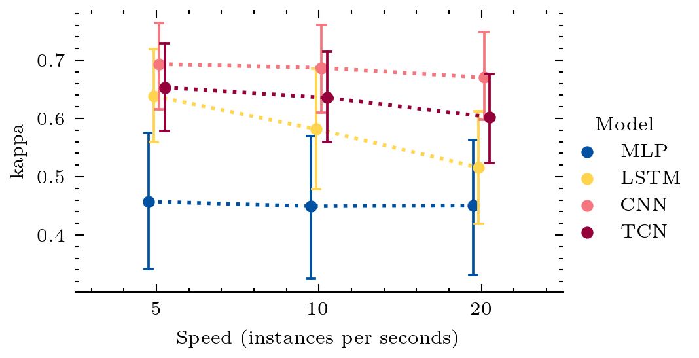
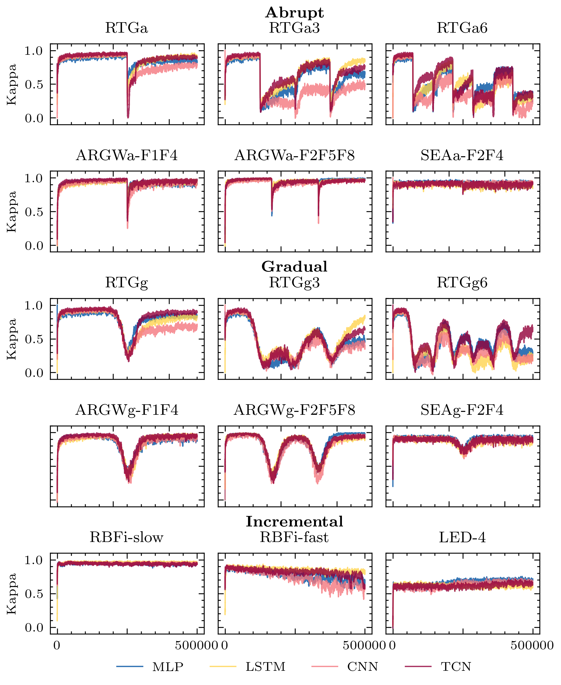

# deep-learning-online-classification
[](https://github.com/pedrolarben/ADLStream/releases/tag/v0.1.3) 
[](https://github.com/tensorflow/tensorflow/releases/tag/v2.2.0)
[](https://github.com/online-ml/river/releases/tag/0.6.0)
[](https://www.python.org/downloads/release/python-360/)
[](https://github.com/psf/black)

Time series classification with deep learning in streaming 

>Processing data streams arriving at high speed requires the development of models that can provide fast and accurate predictions. Although deep neural networks are the state-of-the-art for many machine learning tasks, their performance in real-time data streaming scenarios is a research area that has not yet been fully addressed. Nevertheless, there have been recent efforts to adapt complex deep learning models for streaming tasks by reducing their processing rate. The design of the asynchronous dual-pipeline deep learning framework allows to predict over incoming instances and update the model simultaneously using two separate layers. The aim of this work is to assess the performance of different types of deep architectures for data streaming classification using this framework. We evaluate models such as multi-layer perceptrons, recurrent, convolutional and temporal convolutional neural networks over several time-series datasets that are simulated as streams. In addition, we evaluate how the different architectures react to concept drifts typically found in evolving data streams. The obtained results indicate that convolutional architectures achieve a higher performance in terms of accuracy and efficiency.

## Time series classification experiments

Unzip the time series data
```bash
cd data
unzip data.zip
cd ../
```

Run the python script
```bash
cd src
python experiments_timeseries.py 
```

### Results

|  # |             Dataset            |  MLP  |  LSTM |  CNN  |  TCN  |
|:--:|:------------------------------:|:-----:|:-----:|:-----:|:-----:|
|  1 |           TwoPatterns          | 0.741 | 0.964 | 0.960 | 0.964 |
|  2 |          CinCECGtorso          | 0.381 | 0.875 | 0.930 | 0.805 |
|  3 |           TwoLeadECG           | 0.536 | 0.816 | 0.954 | 0.886 |
|  4 |              Wafer             | 0.926 | 0.964 | 0.965 | 0.954 |
|  5 |            pendigits           | 0.965 | 0.964 | 0.974 | 0.969 |
|  6 |            FacesUCR            | 0.716 | 0.842 | 0.850 | 0.819 |
|  7 |             Mallat             | 0.899 | 0.904 | 0.968 | 0.921 |
|  8 |             FaceAll            | 0.704 | 0.868 | 0.842 | 0.820 |
|  9 |             Symbols            | 0.857 | 0.876 | 0.919 | 0.895 |
| 10 |        ItalyPowerDemand        | 0.919 | 0.866 | 0.916 | 0.915 |
| 11 |             ECG5000            | 0.810 | 0.873 | 0.872 | 0.867 |
| 12 |           MoteStrain           | 0.742 | 0.768 | 0.794 | 0.767 |
| 13 |   NonInvasiveFetalECGThorax1   | 0.050 | 0.620 | 0.735 | 0.597 |
| 14 |   NonInvasiveFetalECGThorax2   | 0.038 | 0.618 | 0.809 | 0.706 |
| 15 |           SwedishLeaf          | 0.634 | 0.674 | 0.752 | 0.701 |
| 16 |              FordA             | 0.003 | 0.397 | 0.526 | 0.722 |
| 17 |              Yoga              | 0.051 | 0.686 | 0.671 | 0.671 |
| 18 |      UWaveGestureLibraryX      | 0.589 | 0.680 | 0.654 | 0.652 |
| 19 |              FordB             | 0.006 | 0.351 | 0.476 | 0.640 |
| 20 |         ElectricDevices        | 0.438 | 0.667 | 0.598 | 0.516 |
| 21 |      UWaveGestureLibraryY      | 0.574 | 0.593 | 0.566 | 0.545 |
| 22 |      UWaveGestureLibraryZ      | 0.551 | 0.614 | 0.570 | 0.574 |
| 23 |          HandOutlines          | 0.006 | 0.500 | 0.624 | 0.230 |
| 24 |       InsectWingbeatSound      | 0.552 | 0.572 | 0.533 | 0.504 |
| 25 |            ShapesAll           | 0.425 | 0.478 | 0.449 | 0.463 |
| 26 |          MedicalImages         | 0.403 | 0.417 | 0.432 | 0.399 |
| 27 |    PhalangesOutlinesCorrect    | 0.140 | 0.427 | 0.501 | 0.430 |
| 28 |      ChlorineConcentration     | 0.002 | 0.316 | 0.676 | 0.587 |
| 29 |             Phoneme            | 0.002 | 0.041 | 0.079 | 0.029 |
|    |          Average kappa         | 0.471 | 0.663 | 0.710 | 0.674 |
|    | Ingerence time per instance (ms) | 4.993 | 22.09 | 7.347 | 47.34 |


<figure>
    
    <figcaption>
    Fig 1. Kappa accuracy results for each model architecture at different stream speed.
    </figcaption>
</figure>

## Concept drift experiments

The syntentic datasets are generated with [River](https://github.com/online-ml/river).

```bash
pip install git+https://github.com/online-ml/river --upgrade
```

Run the experiments
```bash
cd src
python experiments_drift.py
```

### Datasets

|    Dataset   | Attrs | Classes |    IR   |  Drift Type |
|:------------:|:-----:|:-------:|:-------:|:-----------:|
|     RTGa     |   20  |    3    |  4 to 2 |    Abrupt   |
|     RTGa3    |   20  |    3    | 4 to 30 |    Abrupt   |
|  ARGWa-F1F4  |   9   |    2    |  2 to 1 |    Abrupt   |
| ARGWa-F2F5F8 |   9   |    2    | 1 to 50 |    Abrupt   |
|   SEAa-F2F4  |   3   |    2    |    1    |    Abrupt   |
|     RTGg     |   20  |    3    |  4 to 2 |   Gradual   |
|     RTGg3    |   20  |    3    | 4 to 30 |   Gradual   |
|  ARGWg-F1F4  |   9   |    2    |  2 to 1 |   Gradual   |
| ARGWg-F2F5F8 |   9   |    2    | 1 to 50 |   Gradual   |
|   SEAg-F2F4  |   3   |    2    |    1    |   Gradual   |
|   RBFi-slow  |   20  |    3    |    3    | Incremental |
|   RBFi-fast  |   20  |    3    |    3    | Incremental |
|     LED-4    |   24  |    10   |    1    | Incremental |
### Results

<figure>
    
    <figcaption>
    Fig 2. Evolution  of  the  prequential  kappa  of  each  model  over  the  concept-driftdatasets.
    </figcaption>
</figure>

## Authors <a name="authors"></a>

* **Pedro Lara-Benítez** - [@pedrolarben](https://www.github.com/pedrolarben) - [LinkedIn](www.linkedin.com/in/pedrolarben) 
* **Manuel Carranza-García** - [@carranza96](https://www.github.com/carranza96) - [LinkedIn](https://www.linkedin.com/in/manuelcarranzagarcia96/)
* **Francisco Martínez-Álvarez**
* **José C. Riquelme Santos**

## License<a name="license"></a>

This project is licensed under the MIT License - see the [LICENSE.md](LICENSE.md) file for details
